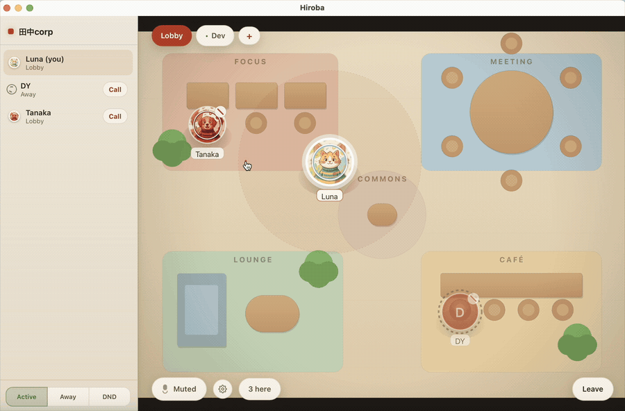

<div align="center">

[English](README.md) | [日本語](README.ja.md)

# Hiroba

**リモートチームのための、オープンソース常駐型プレゼンスアプリ。**

誰がいるか分かる。近づけば、すぐ話せる。

[](https://github.com/ludo-technologies/hiroba/releases/latest)
[](LICENSE)



[**Hirobaをダウンロード**](https://github.com/ludo-technologies/hiroba/releases/latest) · [セルフホストガイド](docs/SELF_HOSTING.md) · [プロトコル仕様](PROTOCOL.md)

</div>

## Hirobaを作った理由

リモートチームには、予定された会議のためのツールはすでにあります。一方で失われたのは、相手がいることに気づき、近づいて「今ちょっといい？」と声をかける、会話が始まる前の小さな瞬間です。

多くのバーチャルオフィスは会議ツールを置き換えようとして、ビデオ、録画、インテグレーションなどの機能を増やし、重くなっていきます。Hirobaは逆の方向を目指します。

- **ひと目で分かる在席状況** — アクティブ、離席中、取り込み中、通話中のメンバーを確認できます。
- **構えずに始められる会話** — 近づいて空間音声で話すか、メンバー一覧から直接呼び出せます。
- **軽さを重視した設計** — Electron製の会議スイートではなく、一日中開いておくためのネイティブTauriクライアントです。
- **オープンでセルフホスト可能** — Rustサーバーを自分で運用すれば、席数制限も機能制限もありません。運用不要のホスト版も利用できます。

今使っている会議ツールはそのままで。Hirobaは、会議と会議の間にある時間のための場所です。

## 仕組み

1. 組織のフロアに入り、誰がどこにいるか確認します。
2. ロビーを移動するか、小さなチームスペースへ切り替えます。
3. 誰かに近づいて話すか、チームメンバーをワンクリックで呼び出します。
4. Hirobaを起動したままにして、必要なときにいつでもチームが集まれる状態にします。

音声はWebRTCによるピアツーピア通信です。常時接続のビデオ、録画、SFUはありません。1対1の呼び出し通話では、その相手にだけ画面を共有することもできます。

## アーキテクチャ

```
        ┌──────────────────────────────┐        WebRTC P2P (Opus)
        │  Rust signaling/state server │      ┌───────────────────────┐
        │  axum + tokio + WebSocket    │      ▼                       ▼
        │  • org roster / presence     │   ┌──────┐  audio only   ┌──────┐
        │  • per-space position relay  │   │client│◀────mesh─────▶│client│
        │  • per-space proximity       │   │Tauri │               │Tauri │
        │  • WebRTC signaling relay    │   └──────┘               └──────┘
        │  • paging (cross-space 1:1)  │       ▲                     ▲
        │  NEVER touches media         │       │  WebSocket (control)│
        └──────────────┬───────────────┘       └─────────────────────┘
                       └──────────────────────────────────────────────┘
```

サーバーが扱うのは、組織のメンバー一覧、スペースごとの位置、近接判定、WebRTCハンドシェイクといった制御データだけです。**音声がサーバーを経由することはありません。** ピア同士がP2Pメッシュで直接接続します。チームスペースやロビーは5人以下での利用に適しています。状態は、全員へ送る**組織のメンバー一覧**と、そのスペースにいる人だけへ送る**スペースごとの位置・近接・音声情報**の2つのスコープに分かれています。通信形式は[`PROTOCOL.md`](PROTOCOL.md)に記載しています。

- **サーバー**（`server/`）— Rust、axum、tokio。単一の静的バイナリです。メディアを扱わないため、小さく低負荷に動作します。
- **クライアント**（`client/`）— RustシェルとOS WebViewからなるTauri、Vanilla TypeScript、Canvas 2Dで構成されています。OS WebView内蔵のWebRTCを使うため、Electronアプリよりもバイナリを小さく軽量にできます。

## クイックスタート（開発）

必要なもの：**Rust**（stable）、**Node.js 18以降**、利用するOS向けの[Tauri v2システム依存パッケージ](https://tauri.app/start/prerequisites/)。

```bash
# 1. サーバーを起動（デフォルトでは0.0.0.0:8787で待ち受け）
cd server
cargo run                      # または HIROBA_ADDR=0.0.0.0:9000 cargo run

# 2. 別のターミナルでクライアントを起動
cd client
npm install
npm run tauri:dev   # 開発用identifier（org.hiroba.app.dev）により、WebViewの
                    # ストレージをインストール済みリリース版から分離します
```

クライアントの参加画面で表示名とアバターの色を選び、サーバーを指定します。ローカル開発では`ws://127.0.0.1:8787/ws`です。2つ目のクライアントを開くと、2人のアバターを確認できます。ロビーで互いに近づけると空間音声が次第に聞こえ、同じチームタブへ切り替えるとグループ通話になります。**参加時はミュート状態です。** マイクボタンをクリックすると発話できます。

操作方法：**WASDキーまたは矢印キー**で移動し、上部の**タブ**でスペースを切り替えます。**サイドバー**には組織のメンバーが表示され、メンバー横の**Call**から相手を呼び出せます。

## リリース成果物のビルド

```bash
# サーバー：最適化済みの単一バイナリをserver/target/release/hiroba-serverに生成
cd server && cargo build --release

# クライアント：ネイティブインストーラー／バンドルを
# client/src-tauri/target/release/bundle/に生成
# 組み込むサーバーURLは必須です。指定しない場合、ビルドは失敗します
# （リリースバンドルがループバックへフォールバックすることはありません）。
cd client && npm install
VITE_HIROBA_SERVER="wss://hiroba.example/ws" \
VITE_HIROBA_AUTH_SERVER="https://auth.hiroba.example" \
npm run tauri build
```

## セルフホスト

サーバーは単一バイナリで、必須の外部サービスはありません。メディアサーバーは不要で、`HIROBA_DB`を指定するとSQLiteを任意で利用できます。デプロイ、設定、ファイアウォール／NAT、TURNサーバーが必要になる条件については、**[docs/SELF_HOSTING.md](docs/SELF_HOSTING.md)**を参照してください。

OAuthログイン、招待、課金を含むマネージドホスト版は別途提供しており、このリポジトリには含まれていません。

## ランディングページ

ランディングページと料金ページからなるマーケティングサイトは、依存関係のない静的サイトとして[`site/`](site/)にあります。`make site`でローカルプレビューを起動できます。

## ライセンス

[Apache-2.0](LICENSE)。特許権の許諾を含みます。

**ブランド資産はApache-2.0の対象外です。** 「Hiroba」の名称、ロゴ、アプリアイコン（`app-icon.png`、`app-icon-macos.png`）、サイトのfavicon、`site/`以下のブランド資産は、Apache-2.0によるライセンス許諾に含まれません。許可なくフォークや派生サービスのブランドとして使用することはできません。それ以外のコード、ドキュメント、プロトコルはApache-2.0です。
