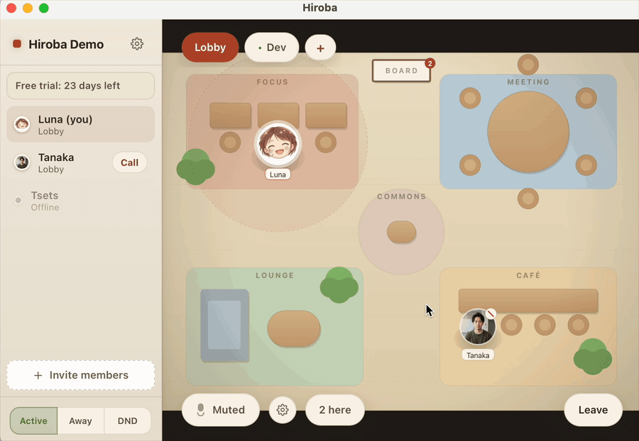

<div align="center">

[English](README.md) | [日本語](README.ja.md)

# Hiroba

**An open-source, always-on presence app for remote teams.**

See who's around. Walk over. Start talking.

[](https://github.com/ludo-technologies/hiroba/releases/latest)
[](LICENSE)



[**Download Hiroba**](https://github.com/ludo-technologies/hiroba/releases/latest) · [Website](https://hirobaoffice.com/) · [Blog](https://hirobaoffice.com/blog/) · [Self-hosting guide](docs/SELF_HOSTING.md) · [Protocol](PROTOCOL.md)

</div>

## Why Hiroba

Remote teams already have tools for scheduled meetings. What they lose is the
small moment before a conversation: seeing that someone is around, walking over,
and asking, "Got a sec?"

Most virtual offices try to replace meeting software and grow heavy with video,
recording, and integrations. Hiroba goes the other way:

- **Presence at a glance** — see who is active, away, busy, or already in a call.
- **Conversation without ceremony** — walk over for spatial voice, or page
  someone directly from the roster.
- **Light by design** — a native Tauri client built to stay open all day, not an
  Electron meeting suite.
- **Open and self-hostable** — run the Rust server yourself with no seat limits
  or feature gating, or use the managed hosted edition.

Keep your existing meeting tool. Hiroba is for everything between the meetings.

## How It Works

1. Join your organization's floor and see where everyone is.
2. Move through the lobby or switch to a small team space.
3. Walk near someone to talk, or call any teammate with one click.
4. Leave Hiroba running so the floor is there when your team needs it.

Voice is WebRTC peer-to-peer. There is no always-on video, recording, or SFU.
During a 1:1 page call, you can optionally share your screen directly with that
peer.

## Architecture

```
        ┌──────────────────────────────┐        WebRTC P2P (Opus)
        │  Rust signaling/state server │      ┌───────────────────────┐
        │  axum + tokio + WebSocket    │      ▼                       ▼
        │  • org roster / presence     │   ┌──────┐  audio only   ┌──────┐
        │  • per-space position relay  │   │client│◀────mesh─────▶│client│
        │  • per-space proximity       │   │Tauri │               │Tauri │
        │  • WebRTC signaling relay    │   └──────┘               └──────┘
        │  • paging (cross-space 1:1)  │       ▲                     ▲
        │  NEVER touches media         │       │  WebSocket (control)│
        └──────────────┬───────────────┘       └─────────────────────┘
                       └──────────────────────────────────────────────┘
```

The server only moves *control* data: the org roster, per-space positions,
proximity decisions, and the WebRTC handshake. **Audio never flows through the
server** — peers connect directly (P2P mesh). A team room or lobby of ≤5 is
comfortable on a mesh. State is split into two scopes — an **org roster**
sent to everyone, and **per-space** position/proximity/audio sent only to those
in that space. The wire format is specified in [`PROTOCOL.md`](PROTOCOL.md).

- **Server** (`server/`) — Rust, axum, tokio. Single static binary. Holds no
  media, so it stays tiny and idle-cheap.
- **Client** (`client/`) — Tauri (Rust shell + OS WebView) with a vanilla
  TypeScript + Canvas 2D frontend. Uses the OS WebView's built-in WebRTC, so the
  binary is far smaller and lighter than an Electron app.

## Quick Start (Development)

Prerequisites: **Rust** (stable), **Node** 18+, and the
[Tauri v2 system dependencies](https://tauri.app/start/prerequisites/) for your OS.

```bash
# 1. Start the server (listens on 0.0.0.0:8787 by default)
cd server
cargo run                      # or: HIROBA_ADDR=0.0.0.0:9000 cargo run

# 2. Start the client (in another terminal)
cd client
npm install
npm run tauri:dev   # dev identifier (org.hiroba.app.dev) keeps WebView
                    # storage isolated from an installed release build
```

In the client's join screen, enter a display name, pick an avatar color, and
point it at your server (`ws://127.0.0.1:8787/ws` for local dev). Open a second
client instance to see two avatars; walk them together in the lobby to hear
spatial voice fade in, or switch both to the same team tab for a group call.
**You start muted** — click the mic button to go live.

Controls: **WASD / arrow keys** to move; the **tabs** (top) switch spaces; the
**sidebar** lists the org — hit **Call** next to a member to page them.

## Building Release Artifacts

```bash
# Server: a single optimized binary at server/target/release/hiroba-server
cd server && cargo build --release

# Client: native installers/bundles under client/src-tauri/target/release/bundle/
# The server URLs to bake in are required — the build fails without them
# (there is intentionally no loopback fallback in release bundles).
cd client && npm install
VITE_HIROBA_SERVER="wss://hiroba.example/ws" \
VITE_HIROBA_AUTH_SERVER="https://auth.hiroba.example" \
npm run tauri build
```

## Self-Hosting

The server is a single binary with no required external services (no media
server; optional SQLite via `HIROBA_DB`). See
**[docs/SELF_HOSTING.md](docs/SELF_HOSTING.md)** for deployment, configuration,
firewall/NAT notes, and when you might need a TURN server.

A managed hosted edition (OAuth sign-in, invites, billing) is offered separately
and is not part of this repository.

## Update Checks

Official builds check for updates shortly after launch and every four hours
while the app stays open. The check is a plain `GET` to

```
https://update.hirobaoffice.com/v1/{{target}}/{{arch}}/{{current_version}}
```

which returns the same signed `latest.json` that GitHub Releases serves, and
the update itself still downloads from GitHub. We log one row per day per
device from those requests: platform, architecture, installed version, and the
country Cloudflare derives from the IP. The device is recorded as a hash of IP
and user agent salted with the current date, so rows cannot be linked across
days, and they are deleted after 90 days.

There is no other telemetry: nothing about your org, floor, teammates, calls,
or usage of the app is collected, and the server ships no analytics SDK.

To turn the check off, remove `plugins.updater.endpoints` from
`client/src-tauri/tauri.conf.json` and build from source — see
[docs/SELF_HOSTING.md](docs/SELF_HOSTING.md#auto-update). Self-hosted
deployments that build their own client never contact us at all.

## License

[Apache-2.0](LICENSE). Includes a patent grant.

**Brand assets are not covered by Apache-2.0.** The "Hiroba" name, logo, and
app icons (`app-icon.png`, `app-icon-macos.png`) are excluded from the
Apache-2.0 license grant. They may not be used to brand a fork or a derived
service without permission. Everything else — code, docs, protocol — is
Apache-2.0.
